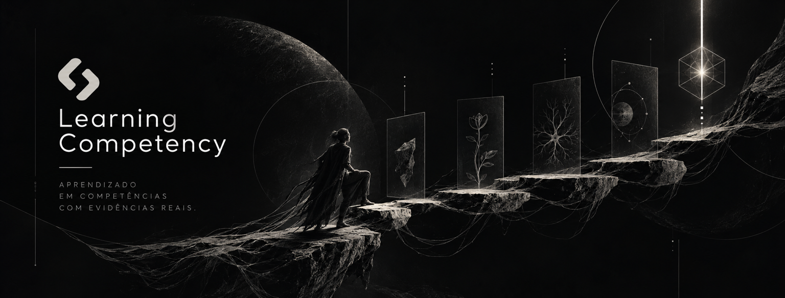

# Learning Competency MVP

<p align="center">
  
</p>

> **Learn → produce evidence → interpret → review → represent state → verify.**

**Experimental MVP for competency development, learning-evidence organization, AI-assisted interpretation, and verifiable attestation on Solana.**

**Primary language:** English · [Versão em Português](README.pt.md)

---

## Quick Start

```bash
npm install
npm test                     # 44 tests — all passing
npm run demo                 # Synthetic scenario: Ana → DEMONSTRATED
npm run m3:attest            # Register attestation on Solana Devnet
npm run m3:verify <hash> <tx> # Verify attestation on-chain
```

> No API key required. AI runs with a deterministic heuristic provider by default.  
> For LLM demo: set `AI_PROVIDER=anthropic`, `ANTHROPIC_API_KEY` and `ANTHROPIC_MODEL` in `.env`.

---

## What We Proved

### M1 — Concrete Use Case ✅ DONE
- Canonical use case: data analysis competency in a corporate L&D program.
- Short trail: A1 (formulate question) → A2 (prepare data) → A3 (reproduce analysis) → A4 (communicate results).
- Four observable criteria: C1 (formulation), C2 (treatment/analysis), C3 (evidence), C4 (communication).

### M2 — Evidence, AI and Review ✅ DONE
- Full TypeScript/Node pipeline: ingest → normalize → extract → interpret → relate → review → state.
- Strict AI contract via `zod`: AI proposes, **never** decides `DEMONSTRATED`.
- **44 tests** covering the critical path and hardening — all passing.
- Handoff (`ReviewedStateRecord`) ready for M3 consumption.

### M3 — State, Attestation and Solana ✅ DONE (Devnet)
- `src/solana/attest.ts`: records attestation via SPL Memo Program (off-chain storage pattern).
- `src/solana/verify.ts`: given a `record_hash` and `tx_signature`, confirms on-chain proof.
- Attestation creation and verification are covered by dedicated M3 tests.

> 🔗 **Live proof on Solana Devnet:**  
> [`27hwuMbf5SxA...3y3U`](https://explorer.solana.com/tx/27hwuMbf5SxAERnHa277vFLUzkutqHFkp85dmNQ2TpeVsvMw5EASoShbtipn6EqzPK15GurpJuuXE1KtCYhr3y3U?cluster=devnet)

### Interface — UX/UI ⏳ IN PROGRESS
- Owner: [JP Fernandes](https://github.com/JpFernandes77).

### M4 — Validation, Demo and Submission ⏳ IN PROGRESS
- Demand validation: [Erick](https://github.com/erickandregarcia-ai).
- Demo script: [`docs/demo/DEMO_SCRIPT.md`](docs/demo/DEMO_SCRIPT.md).

---

## Overview

The **Learning Competency MVP** investigates a central question:

> **How does an organization transform a competency need into a development trail, capture evidence produced by a person, interpret that evidence with AI and human review, and represent — in a verifiable way — the state of that evolution?**

The project is deliberately small: the goal is not to build a complete learning platform, but to prove a vertical, traceable, and end-to-end verifiable flow.

The central hypothesis is that the value lies not only in recording courses or certificates, but in **closing the loop between competency need, development, evidence, interpretation, review, and verification**.

---

## The Central Flow

```text
ORGANIZATION / PROGRAM
        ↓
DESIRED COMPETENCY
        ↓
SHORT DEVELOPMENT TRAIL
        ↓
PERSON
        ↓
ACTIVITIES
        ↓
EVIDENCE
        ↓
AI INTERPRETATION
        ↓
HUMAN REVIEW
        ↓
COMPETENCY STATE
        ↓
ATTESTATION / PROOF
        ↓
SOLANA
        ↓
VERIFICATION
```

---

## Core Principles

1. **Evidence ≠ Interpretation.** Source data, AI extraction, and human decisions are kept separate and traceable at every step.
2. **AI proposes, humans decide.** AI may structure, relate, and synthesize evidence — but only a human reviewer can transition state to `DEMONSTRATED`.
3. **Human review is a product mechanism, not a checkbox.** The reviewer accepts, corrects, rejects, or requests new evidence. Every decision is recorded.
4. **Verification ≠ inference.** The trust scale goes N1 (self-declared) → N2 (evidence presented) → N3 (evidence analyzed) → N4 (source verified). AI supports N1–N3. N4 requires external authenticated verification.
5. **Solana is an integrity layer, not decoration.** Only the `record_hash` and minimal metadata go on-chain. Sensitive data stays off-chain.

---

## Architecture — Evidence Pipeline

```text
INGEST → NORMALIZE → EXTRACT → INTERPRET (AI) → RELATE TO COMPETENCY
                                                        ↓
                                               HUMAN REVIEW
                                                        ↓
                                               STATE UPDATE
                                                        ↓
                                          ATTESTATION → SOLANA → VERIFICATION
```

The pipeline preserves provenance and differentiates: source data, extracted information, AI-produced interpretation, human review decision, resulting state, and registered attestation.

---

## MVP Scope

### In scope
- one concrete competency; one short trail; one person; a small set of evidence types;
- evidence ingestion, normalization, AI-assisted interpretation, human review;
- minimal competency state representation and attestation object;
- Solana integration and verification path; critical flow tests.

### Out of scope
- complete LMS; course marketplace; recruitment platform; broad course catalog;
- extensive institutional integrations; universal competency methodology;
- definitive monetization model; sensitive data directly on-chain.

---

## Documentation

### Product
- [MVP Contract](docs/product/MVP_CONTRACT.md) · [User Journeys](docs/product/USER_JOURNEYS.md) · [Use Case](docs/product/USE_CASE.md)

### Architecture
- [Evidence Pipeline](docs/architecture/EVIDENCE_PIPELINE.md) · [Attestation Model](docs/architecture/ATTESTATION_MODEL.md) · [M2 Implementation](docs/architecture/M2_IMPLEMENTATION.md)

### Market and Validation
- [Competitive Landscape](docs/market/COMPETITIVE_LANDSCAPE.md) · [GTM Model](docs/go-to-market/GTM.md) · [Demand Validation](docs/validation/DEMAND_VALIDATION.md)

### Governance and Execution
- [Project Status](docs/PROJECT_STATUS.md) · [Team Roles](docs/governance/TEAM_ROLES.md) · [Red-Team Evaluation](docs/evaluation/HACKATHON_EVALUATION_01.md) · [Contributing](CONTRIBUTING.md)

### Hackathon
- [Demo Script](docs/demo/DEMO_SCRIPT.md) · [Development Log](docs/diario-de-bordo/) · [Hackathon Structure](docs/hackathon/README.md) · [Dataroom Analysis](docs/hackathon/DATAROOM_ANALYSIS.md)

---

## Repository Structure

```text
.
├── docs/
│   ├── product/ · architecture/ · market/ · go-to-market/
│   ├── governance/ · decisions/ · validation/ · evaluation/
│   ├── hackathon/ · demo/ · brand/ · diario-de-bordo/
│   └── PROJECT_STATUS.md
├── fixtures/
│   └── synthetic/ana/          # Synthetic scenario: Ana, Junior Data Analyst
├── src/
│   ├── ai/                     # AI contract and provider (zod-validated)
│   ├── evidence/               # Ingest, normalize, extract
│   ├── relation/               # Relate evidence to competency criteria
│   ├── review/                 # Human review engine
│   ├── state/                  # Competency state machine
│   ├── provenance/             # Trace and handoff (M2 → M3)
│   ├── solana/                 # attest.ts + verify.ts
│   ├── domain/                 # Types and use case definitions
│   └── cli/                    # Demo CLI
├── tests/                      # 44 tests — all passing
├── .env.example · .gitattributes · CONTRIBUTING.md
```

---

## Team

| Person | Core Contribution | Why It Matters |
|---|---|---|
| **[Erick](https://github.com/erickandregarcia-ai)** | Research, context, market and operations | Translates external signals into requirements; ensures the product stays connected to the real problem |
| **[JP Carvalho](https://github.com/Joaopedro0s)** | M2 — evidence pipeline, AI and review | Materializes the central flow in testable, traceable code |
| **[JP Fernandes](https://github.com/JpFernandes77)** | Branding, UX/UI and interface | Makes the product visible and understandable to those who won't clone the repository |
| **[JX](https://github.com/SH1W4)** | Architecture, AI, evidence, attestation and Solana | Connects the technical thesis to the integrity and on-chain verifiability model |

No contribution replaces the others. The value lies in the combination.

---

## Hackathon History

**Started:** September 25, 2026. **What existed before:** only the initial idea of a microcredential platform.

**Built during the hackathon:**
- M1: canonical use case definition and evidence contracts
- M2: full TypeScript pipeline (ingest → AI → human review → state), **44 tests**
- M3: Solana attestation infrastructure (Memo Program, off-chain storage pattern, on-chain verification)
- Operational governance v1.0 and Development Log with decision traceability

---

## License

License and distribution terms will be defined before a final version is published.
